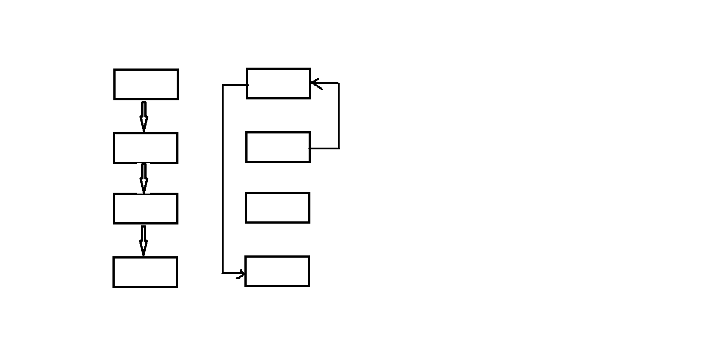

## [LeetCode两两交换链表中的节点](https://leetcode-cn.com/problems/swap-nodes-in-pairs/)

给定一个链表，两两交换其中相邻的节点，并返回交换后的链表。

示例:
```
给定 1->2->3->4, 你应该返回 2->1->4->3.
```
说明:

你的算法只能使用常数的额外空间。
你不能只是单纯的改变节点内部的值，而是需要实际的进行节点交换。
***
用`tail`指向已经交换好的链表尾部, 未交换的头部        
将`tail->next`指向其之后的第三个节点(反转后就是两个相邻的节点), 如果其之后只有两个节点(节点数为奇数的链表尾部),指向第二个节点     
将`tail`之后的第一个节点的`next`指向`tail`
