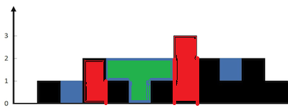

## [LeetCode接雨水](https://leetcode-cn.com/problems/trapping-rain-water/)

给定`n`个非负整数表示每个宽度为 1 的柱子的高度图，计算按此排列的柱子，下雨之后能接多少雨水。


上面是由数组 [0,1,0,2,1,0,1,3,2,1,2,1] 表示的高度图，在这种情况下，可以接 6 个单位的雨水（蓝色部分表示雨水）。 感谢**Marcos**贡献此图。
示例:
```
输入: [0,1,0,2,1,0,1,3,2,1,2,1]
输出: 6
```
***
先把每个柱子所属于的“坑”的两边的高度找出来



上图绿色区域的水的“坑”两边就是红色的区域，高度分别是2、3                
先求左边的坑边高度，前一个的高度和前面全部最高的高度比较
```
for (int i = 1; i < n - 1; ++i) {
    left[i] = max(left[i - 1], height[i - 1]);
}
```
右边就是从数组的尾部开始遍历，方式是一样的                   
        
最后再通过坑两边较小的那边减去每列坑底的高度，求和就是结果
```
int t = min(left[i], right[i]) - height[i];
result += max(t, 0);
```
> 当遍历到坑边自己的时候，t < 0, 应该排除掉